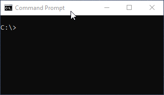

# [TSE Client](https://www.npmjs.com/package/tse-client) [](https://GitHub.com/m-ahmadi/tse-client/tags/) [](https://GitHub.com/m-ahmadi/tse-client/issues/) 
A client for fetching stock data from the Tehran Stock Exchange (TSETMC).  
Works in Browser, Node, and as CLI.  
The `0.x` and `1.x` versions were a direct port of the [official Windows app](http://cdn.tsetmc.com/Site.aspx?ParTree=111A11). 

<p float="left">
	
	
</p>

### [Table of Contents](#table-of-contents)
- [CLI](#cli)
	+ [Install](#install)
	+ [Usage examples](#basic)
- [Node](#node)
	+ [Install](#install-1)
	+ [Usage example](#usage)
- [Browser](#browser)
	+ [Usage example 1](#using-standalone-bundle)
	+ [Usage example 2](#using-the-module-itself)
	+ [Some Info](#some-info)
- [API](#api)
	+ [`API_URL`](#tseapi_url)
	+ [`UPDATE_INTERVAL`](#tseupdate_interval)
	+ [`PRICES_UPDATE_CHUNK`](#tseprices_update_chunk)
	+ [`PRICES_UPDATE_CHUNK_DELAY`](#tseprices_update_chunk_delay)
	+ [`PRICES_UPDATE_RETRY_COUNT`](#tseprices_update_retry_count)
	+ [`PRICES_UPDATE_RETRY_DELAY`](#tseprices_update_retry_delay)
	+ [`CACHE_DIR`](#tsecache_dir)
	+ [`getInstruments()`](#tsegetinstrumentsstruct-boolean-arr-boolean-structkey-string)
	+ [`getPrices()`](#tsegetpricessymbols-string-settings-pricesettings)
	+ [`columnList`](#tsecolumnlist)
	+ [`INTRADAY_URL`](#tseintraday_url)
	+ [`INTRADAY_UPDATE_CHUNK_DELAY`](#tseintraday_update_chunk_delay)
	+ [`INTRADAY_UPDATE_RETRY_COUNT`](#tseintraday_update_retry_count)
	+ [`INTRADAY_UPDATE_RETRY_DELAY`](#tseintraday_update_retry_delay)
	+ [`INTRADAY_UPDATE_FIRST_SERVER`](#tseintraday_update_first_server)
	+ [`getIntraday()`](#tsegetintradaysymbols-string-settings-intradaysettings)
	+ [`getIntradayInstruments()`](#tsegetintradayinstrumentsstruct-boolean-arr-boolean-structkey-string)
	+ [`itdGroupCols`](#tseitdgroupcols)
		- [`price`](#price)
		- [`order`](#order)
		- [`trade`](#trade)
		- [`client`](#client)
		- [`misc`](#misc)
		- [`shareholder`](#shareholder)
- [Some Notes](#some-notes)	
	+ [تغییر نمادهای متشابه](#renamed-symbols)
	
# CLI

#### Install:
```shell
npm install tse-client -g
```
#### Basic:
```shell
tse ذوب
tse ذوب فولاد خساپا شپنا
tse "شاخص کل6"
tse "شاخص کل فرابورس6" "شاخص کل (هم وزن)6"
```
#### Adjust prices:
```shell
tse آپ -j 1 # افزایش سرمایه + سود نقدی
tse آپ -j 2 # افزایش سرمایه
```
#### Select columns:
```shell
tse فملی -c "2,3,4,6"
tse فملی -c "2:OPEN 3:HIGH 4:LOW 6:CLOSE"
tse فملی -c "0 6 8 7"
tse فملی -c "0:date 6:closing 8:trades 7:volume"
tse ls -A
tse ls -D
# default: "0 2 3 4 5 6 7 8 9"
```
#### History depth:
```shell
tse ذوب -b 3m       # سه ماه گذشته (پیشفرض)
tse ذوب -b 40d      # چهل روز گذشته
tse ذوب -b 2y       # دو سال گذشته
tse ذوب -b 13920101 # تاریخ شمسی
tse ذوب -b 20160101 # تاریخ میلادی
tse ذوب -b 13800101 # کمترین تاریخ ممکن
tse ذوب -b 20030123 # کمترین تاریخ ممکن به میلادی
```
#### File generation:
```shell
tse کگل -o /mydir # output directory
tse کگل -n 3      # file name
tse کگل -x txt    # file extension
tse کگل -e ascii  # file encoding
tse کگل -l @      # file delimiter char
tse کگل -H        # file without headers
```
#### Select symbols from file:
```shell
tse ls -F "i=34" > car.txt
tse ls -F "i=27" > iron.txt
tse -i car.txt -o ./car-group
tse -i iron.txt -o ./iron-group
```
#### Select symbols by filter:
```shell
# tse -f "t= نوع نماد i= گروه صنعت m= نوع بازار"
tse -f "i=27"                 # گروه صنعت: فلزات اساسی
tse -f "i=27 t=300"           # گروه صنعت: فلزات اساسی & نوع نماد: سهم بورس
tse -f "m=4 i=27,53,38 t=404" # نوع بازار: پایه & گروه صنعت: فلزات و سیمان و قند & نوع نماد: حق تقدم

tse ls -T
tse ls -I
tse ls -M

tse ls -F "i=27 t=300" # گروه فلزات بازار بورس
tse ls -F "i=27 t=303" # گروه فلزات بازار فرابورس
tse ls -F "i=27 t=309" # گروه فلزات بازار پایه

tse ls -F "i=34 t=300" # گروه خودرو بازار بورس
tse ls -F "i=34 t=303" # گروه خودرو بازار فرابورس
tse ls -F "i=34 t=309" # گروه خودرو بازار پایه

tse ls -F "t=68"       # شاخص های بازار بورس
tse ls -F "t=69"       # شاخص های بازار فرابورس
```
#### Save settings:
```shell
tse ذوب فولاد -o ./mytse --save
tse
tse -x txt
tse -n 3 --save
tse -o ./myother --save
tse
```
#### Disable caching:
```shell
tse ذوب -k
```
#### View saved settings and more:
```shell
tse ls -S
tse ls -D
tse ls -F "i=34"
tse ls -F "i=27 t=300"
tse ls -M -T -I
tse ls -T -O 1  # order by count (descending)
tse ls -T -O 1_ # order by count (ascending)
tse ls -h
```

#### Intraday crawler (Experimental):
```shell
tse itd ذوب -o ./mydata             # basic (crawl last day)
tse itd ذوب                         # update but do not generate output
tse itd ذوب -b 6d                   # crawl last 6 days
tse itd ذوب -b 30d -m 20d           # crawl 10 days (from 30 days ago to 20 days ago)
tse itd ذوب -b 13991201 -m 13991206 # crawl 6 days
tse itd ذوب -b 20210219 -m 20210224 # crawl 6 days (Western dates)
tse itd ذوب -k -o .                 # do not cache the data
tse itd ذوب -z -o .                 # output gzip files
tse itd ذوب -y -o .                 # generate results with Shamsi dates
tse itd ذوب -r                      # re-download already cached days that have no `trade` data

tse itd ذوب -o . -e ascii # file encoding
tse itd ذوب -o . -n 2     # directory name
tse itd ذوب -o . -H       # file without headers
```

# Node

#### Install:
```shell
npm install tse-client
```
#### Usage:
```javascript
const tse = require('tse-client');

(async () => {
  
  // basic
  let { error, data } = await tse.getPrices(['ذوب', 'فولاد']);
  if (!error) console.log(data);
  
  // adjusted data
  let { data } = await tse.getPrices(['خساپا'], {adjustPrices: 1});
  
  // select columns (default names)
  let { data } = await tse.getPrices(['شپنا'], {columns: [0,3,4]});
  
  // select columns (custom names)
  let { data } = await tse.getPrices(['شپنا'], {columns: [[0,'DATE'],[3,'MAX'],[4,'MIN']]});
  
  // view column info
  console.table(tse.columnList);
  
  // list of instruments
  let instruments = await tse.getInstruments();
  console.log(
    instruments.filter(i => i.YVal === '300' && i.CSecVal === '27') // گروه فلزات بازار بورس
  );
  
  // intraday crawler
  let { data, error } = await tse.getIntraday(['ذوب', 'فولاد']), {
    startDate: '20201122',
    endDate: '20201122',
    gzip: false
  });
  
})();
```

# Browser
#### Using standalone bundle:
*(bundled with the 4 dependencies)*
```html
<script src="https://cdn.jsdelivr.net/npm/tse-client/dist/tse.bundle.min.js"></script>
<script>
  (async () => {

    // basic
    let { error, data } = await tse.getPrices(['ذوب', 'فولاد']);
    if (!error) console.log(data);
    
    // adjusted data
    let { data } = await tse.getPrices(['خساپا'], {adjustPrices: 1});
    
    // select columns (default names)
    let { data } = await tse.getPrices(['شپنا'], {columns: [0,3,4]});
    
    // select columns (custom names)
    let { data } = await tse.getPrices(['شپنا'], {columns: [[0,'DATE'],[3,'MAX'],[4,'MIN']]});
    
    // view column info
    console.table(tse.columnList);
    
    // list of instruments
    let instruments = await tse.getInstruments();
    console.log(
      instruments.filter(i => i.YVal === '300' && i.CSecVal === '27') // گروه فلزات بازار بورس
    );
   
   // intraday crawler
   let { data, error } = await tse.getIntraday(['ذوب', 'فولاد']), {
      startDate: '20201122',
      endDate: '20201122',
      gzip: false
   });
    
  })();
</script>
```

#### Using the module itself:
*(dependencies must be loaded before)*
```html
<script src="https://cdn.jsdelivr.net/npm/big.js"></script>
<script src="https://cdn.jsdelivr.net/npm/localforage"></script>
<script src="https://cdn.jsdelivr.net/npm/jalaali-js/dist/jalaali.min.js"></script>
<script src="https://cdn.jsdelivr.net/npm/pako/dist/pako.min.js"></script>

<script src="https://cdn.jsdelivr.net/npm/tse-client/dist/tse.min.js"></script>
<script>
  tse.getPrices(['فولاد']).then(({data}) => console.log(data[0]));
</script>
```

#### Using behind a simple `PHP` proxy:
```php
// proxy.php
<?php
$t  = isset($_GET['t'])  ? $_GET['t']  : '';
$a  = isset($_GET['a'])  ? $_GET['a']  : '';
$a2 = isset($_GET['a2']) ? $_GET['a2'] : '';

echo file_get_contents("http://service.tsetmc.com/tsev2/data/TseClient2.aspx?t=$t&a=$a&a2=$a2");
?>
```
```javascript
tse.API_URL = 'http://path/to/proxy.php';
tse.getPrices(['فولاد']).then(({data}) => console.log(data[0]));
```
#### Some Info:
| file | desc
|------------------------|-----------------------|
|`dist/tse.js`           | Unminified code. |
|`dist/tse.min.js`       | Minified code. |
|`dist/tse.bundle.min.js`| Minified dependencies + minified code. |

dependency | desc
-------|-------------
`big.js`      | `Required`. For price adjustment calculations.
`localforage` | `Required`. For storing in `indexedDB`. 
`jalaali-js`  | `Optional`. Only needed for `ShamsiDate` column. *(Recommanded to not exclude this, though you can)*
`pako`        | `Semi-Required`. Only used by [`getIntraday()`](#tsegetintradaysymbols-string-settings-intradaysettings).


# API

#### `tse.API_URL`
The API URL to use for HTTP requests.  
Only string and valid URL.  
Default: `http://service.tsetmc.com/tsev2/data/TseClient2.aspx`
#### `tse.UPDATE_INTERVAL`
Update data only if these many days have passed since the last update.  
Only integers.  
Default: `1`
#### `tse.PRICES_UPDATE_CHUNK`
Amount of instruments per request.  
Only integers.  
Min: `1`  
Max: `60`  
Default: `50`
#### `tse.PRICES_UPDATE_CHUNK_DELAY`
Amount of delay (in ms) to wait before requesting another chunk of instruments.  
Default: `300`
#### `tse.PRICES_UPDATE_RETRY_COUNT`
Amount of retry attempts before giving up.  
Only integers.  
Default: `3`
#### `tse.PRICES_UPDATE_RETRY_DELAY`
Amount of delay (in ms) to wait before making another retry.  
Only integers.  
Default: `1000`
#### `tse.CACHE_DIR`
Only in `Node`.  
Location of the cache directory.  
If the location is changed, existing content is not moved to the new location.  
Default: &ensp; *`User's home directoy:`* &ensp; `require('os').homedir()`  
#### `tse.getInstruments(struct?: boolean, arr?: boolean, structKey?: string)`
Update (if needed) and return list of instruments.  
- **`struct`:** Determine the return type for each instrument. Default `true`
	+ `true`: return an `Instrument` object for each instrument.
	+ `false`: return a CSV string for each instrument.
- **`arr`:** Determine the return type. Default: `true`
	+ `true`: return an array.
	+ `false` return an `Instruments` object.
- **`structKey`:** Which key of `Instrument` to use when `struct` is set to `true`. Default: `'InsCode'`

**return:** `Array<Instrument | string> | Instruments`  

Visit the [official documentation](http://cdn.tsetmc.com/Site.aspx?ParTree=1114111118&LnkIdn=83) for description of each `Instrument` field.  
```typescript
interface Instrument {
//                            👇 C# equivalent
  InsCode:         string;  // long (int64)
  InstrumentID:    string;  // string
  LatinSymbol:     string;  // string
  LatinName:       string;  // string
  CompanyCode:     string;  // string
  Symbol:          string;  // string
  Name:            string;  // string
  CIsin:           string;  // string
  DEven:           string;  // int (int32)
  Flow:            string;  // byte
  LSoc30:          string;  // string
  CGdSVal:         string;  // string
  CGrValCot:       string;  // string
  YMarNSC:         string;  // string
  CComVal:         string;  // string
  CSecVal:         string;  // string
  CSoSecVal:       string;  // string
  YVal:            string;  // string
  SymbolOriginal?: string;
}

interface Instruments {
  [Instrument.InsCode]: Instrument | string;
}
```
#### `tse.getPrices(symbols: string[], settings?: PriceSettings)`
Update (if needed) and return prices of instruments.  
- **`symbols`:** An array of *`Farsi`* instrument symbols.  
- **`settings`:** A settings object.
	+ **`columns`:** Select which `ClosingPrice` props to return and specify optional string for the prop.  
		For example: `[ [0,'DATE'], [6,'CLOSE'], [7,'VOL'] ]`  
		Default: `[0,2,3,4,5,6,7,8,9]`  
		See [`columnList`](#tsecolumnlist) for the list of all column indexes and their names.
	+ **`adjustPrices`:** The type of adjustment applied to returned prices.  
		`0`: None &emsp; &emsp;&emsp;&emsp;&emsp;&emsp;&emsp;&emsp;&emsp;&emsp;&emsp;(*`بدون تعدیل`*)  
		`1`: Capital Increase + Dividends &emsp; (*`افزایش سرمایه + سود نقدی`*)  
		`2`: Capital Increase &emsp;&emsp;&emsp;&emsp;&emsp;&emsp;&emsp;(*`افزایش سرمایه`*)
	+ **`startDate`:** Only return prices after this date. Min: `'20010321'`. Default: `'20010321'`
	+ **`daysWithoutTrade`:** Whether to include days that have `0` trades. Default: `false`
	+ **`cache`:** Whether to cache the downloaded data. Default: `true`
	+ **`csv`:** Generate results as CSV strings. Default: `false`
	+ **`csvHeaders`:** Include header row when generating CSV results. Default: `true`
	+ **`csvDelimiter`:** A cell delimiter character to use when generating CSV results. Default: `','`
	+ **`onprogress`:** A callback function which gets called with a number indicating the progress. Default: `undefined`
	+ **`progressTotal`:** A number to use as the completion point of progress. Default: `100`

**return:** `Result`
```typescript
interface Result {
  data:   Array<ClosingPrice>;
  error?: CustomError;
}

interface ClosingPrice {
//                          👇 C# equivalent of array item
  date:        number[];  // int     (int32)
  dateshamsi:  number[];  // int     (int32)
  open:        number[];  // decimal (float128)
  high:        number[];  // decimal (float128)
  low:         number[];  // decimal (float128)
  last:        number[];  // decimal (float128)
  close:       number[];  // decimal (float128)
  vol:         number[];  // decimal (float128)
  count:       number[];  // decimal (float128)
  value:       number[];  // decimal (float128)
  yesterday:   number[];  // decimal (float128)
  symbol:      string[];  // string
  name:        string[];  // string
  namelatin:   string[];  // string
  companycode: string[];  // string
}

interface PriceSettings {               
  columns?:                     Array<[number, string?]>;
  adjustPrices?:                AdjustOption;
  daysWithoutTrade?:            boolean;
  startDate?:                   string;
  cache?:                       boolean;
  onprogress?(current: number): void;
  progressTotal?:               number;
}

interface CustomError {
  code:     ErrorType;
  title:    string;
  detail?:  string | Error;
  symbols?: string[];
  fails?:   string[];
  succs?:   string[];
}

enum AdjustOption {
  None = 0,
  CapitalIncreasePlusDividends = 1,
  CapitalIncrease = 2
}

enum ErrorType {
  FailedRequest = 1,
  IncorrectSymbol = 2,
  IncompletePriceUpdate = 3
}
```
**Example:**
```javascript
const defaultSettings = {
  columns:          [0,2,3,4,5,6,7,8,9],
  adjustPrices:     0,
  daysWithoutTrade: false,
  startDate:        '20010321',
  csv:              false,
  csvHeaders:       true,
  csvDelimiter:     ',',
  onprogress:       undefined,
  progressTotal:    100
};

const result = await tse.getPrices(symbols=['sym1', 'sym2', ...], defaultSettings);

result.data /*
  [
    // sym1
    {
      open:  [0, 0, ...],
      high:  [0, 0, ...],
      low:   [0, 0, ...],
      last:  [0, 0, ...],
      close: [0, 0, ...],
      vol:   [0, 0, ...],
      count: [0, 0, ...],
      value: [0, 0, ...]
    },

    // sym2
    {
      open: [],
      high: [],
      ...
    },

    ...
  ]
*/

result.error // possible values:

undefined

{ code: 1, title: 'Failed request...',       detail: '' | Error }

{ code: 2, title: 'Incorrect Symbol',        symbols: [] }

{ code: 3, title: 'Incomplete Price Update', fails: [], succs: [] }

```

#### `tse.columnList`
A list of all possible columns.
index | name        | fname
------|-------------|------------------
0     | date        | تاریخ میلادی
1     | dateshamsi  | تاریخ شمسی
2     | open        | اولین قیمت
3     | high        | بیشترین قیمت
4     | low         | کمترین قیمت
5     | last        | آخرین قیمت
6     | close       | قیمت پایانی
7     | vol         | حجم معاملات
8     | count       | تعداد معاملات
9     | value       | ارزش معاملات
10    | yesterday   | قیمت پایانی دیروز
11    | symbol      | نماد
12    | name        | نام
13    | namelatin   | نام لاتین
14    | companycode | کد شرکت


#### `tse.INTRADAY_URL`
The URL from which the data is crawled.  
Must be a function that returns a valid URL string.  
Default:
```javascript
(server='', inscode='', deven='') => `http://cdn${server}.tsetmc.com/Loader.aspx?ParTree=15131P&i=${inscode}&d=${deven}`;
```
#### `tse.INTRADAY_UPDATE_CHUNK_DELAY`
Amount of delay (in ms) to wait before requesting another chunk of dates.  
Default: `100`
#### `tse.INTRADAY_UPDATE_RETRY_COUNT`
Amount of retry attempts before giving up.  
Only integers.  
Default: `9`
#### `tse.INTRADAY_UPDATE_RETRY_DELAY`
Amount of delay (in ms) to wait before making another retry.  
Only integers.  
Default: `1000`
#### `tse.INTRADAY_UPDATE_FIRST_SERVER`
The CDN server from which to start the update process.  
Value of `0` will result to `cdn.tsetmc.com` base URLs.  
Only integers.  
Default: `1`
#### `tse.getIntradayInstruments(struct?: boolean, arr?: boolean, structKey?: string)`
Returns the list of instruments crawled by [`getIntraday()`](#tsegetintradaysymbols-string-settings-intradaysettings).  
The information of each instrument is from the latest crawled day.  
- **`struct`:** Determine the return type for each instrument. Default `true`
	+ `true`: return an `InstrumentITD` object for each instrument.
	+ `false`: return a CSV string for each instrument.
- **`arr`:** Determine the return type. Default: `true`
	+ `true`: return an array.
	+ `false` return an `InstrumentsITD` object.
- **`structKey`:** Which key of `InstrumentITD` to use when `struct` is set to `true`. Default: `'InsCode'`

**return:** `Array<InstrumentITD | string> | InstrumentsITD`  

```typescript
interface InstrumentITD {
  InsCode:      string;
  LVal30:       string;
  LVal18AFC:    string;
  FlowNameBare: string;
  FlowName:     string;
  Flow:         string;
  CGrValCot:    string;
  CIsin:        string;
  InstrumentID: string;
  ZTitad:       string;
  BaseVol:      string;
}

interface InstrumentsITD {
  [InstrumentITD.InsCode]: InstrumentITD | string;
}
```
#### `tse.getIntraday(symbols: string[], settings?: IntradaySettings)`
Crawl intraday data from the instrument's history page of the [tsetmc.com](http://tsetmc.com) website. **(Experimental)**
- **`symbols`:** An array of *`Farsi`* instrument symbols.  
- **`settings`:** A settings object.
	+ **`startDate`:** Only return data after this date. Min: `'20010321'`. Default: `'20010321'`
	+ **`endDate`:** Only return data before this date. Default: `''`
	+ **`cache`:** Whether to cache the downloaded data. Default: `true`
	+ **`gzip`:** Return data as Gzip `Buffer` in Node or `Uint8Array` in Browser. Default: `true`
	+ **`reUpdateNoTrades`:** Re-download any cached item that has no [`trade`](#trade) data. Default: `false`
	+ **`onprogress`:** A callback function which gets called with a number indicating the progress. Default: `undefined`
	+ **`progressTotal`:** A number to use as the completion point of progress. Default: `100`

**return:** `Result`
```typescript
interface Result {
  data:   Array< [number[], Array<Buffer | Uint8Array | string>] >;
  error?: CustomError;
}

interface IntradaySettings {               
  startDate?:                   string;
  endDate?:                     string;
  cache?:                       boolean;
  gzip?:                        boolean;
  onprogress?(current: number): void;
  progressTotal?:               number;
}

interface CustomError {
  code:     ErrorType;
  title:    string;
  detail?:  string | Error;
  symbols?: string[];
  fails?:   string[];
  succs?:   string[];
}

enum ErrorType {
  FailedRequest = 1,
  IncorrectSymbol = 2,
  IncompletePriceUpdate = 3,
  IncompleteIntradayUpdate = 4
}
```

#### `tse.itdGroupCols`
A list of all intraday data groups and their column names.

## `price`
time | last      | close    | open | high | low   | count     | volume    | value       | discarded
---- |-----------|----------|------|------|-------|-----------|-----------|-------------|-----------
زمان  | آخرین معامله | قیمت پایانی | اولین  | بیشترین | کمترین | تعداد معاملات | حجم معاملات |  ارزش معاملات | باطل شده


## `order`
time | row  | askcount | askvol   | askprice | bidprice  | bidvol  | bidcount
-----|------|----------|----------|----------|-----------|---------|---------
زمان  | ردیف | تعداد تقاضا  | حجم تقاضا  | قیمت تقاضا | قیمت عرضه | حجم عرضه | تعداد عرضه


## `trade`
time | count | volume | price | discarded
-----|-------|--------|-------|---------
زمان  | تعداد   | حجم    | قیمت   | باطل شده 

## [`client`](http://cdn.tsetmc.com/Site.aspx?ParTree=1114111116&LnkIdn=3568)

column | desc | desc Fa
-----------|----------------------------------------|----------------------------
`pbvol`    | Person Buy Volume                      | حجم خرید حقیقی
`pbcount`  | Person Buy Count                       | تعداد خرید حقیقی
`pbval`    | Person Buy Value                       | ارزش خرید حقیقی
`pbprice`  | Person Buy Price                       | قیمت خرید حقیقی
`pbvolpot` | Person Buy Volume Percentage of Total  | درصد حجم خرید حقیقی از کل حجم
.          |                                        |
`psvol`    | Person Sell Volume                     | حجم فروش حقیقی
`pscount`  | Person Sell Count                      | تعداد فروش حقیقی
`psval`    | Person Sell Value                      | ارزش فروش حقیقی
`psprice`  | Person Sell Price                      | قیمت فروش حقیقی
`psvolpot` | Person Sell Volume Percentage of Total | درصد حجم فروش حقیقی از کل حجم
.          |                                        | 
`lbvol`    | Legal Buy Volume                       | حجم خرید حقوقی
`lbcount`  | Legal Buy Count                        | تعداد خرید حقوقی
`lbval`    | Legal Buy Value                        | ارزش خرید حقوقی
`lbprice`  | Legal Buy Price                        | قیمت خرید حقوقی
`lbvolpot` | Legal Buy Volume Percentage of Total   | درصد حجم خرید حقوقی از کل حجم
.          |                                        | 
`lsvol`    | Legal Sell Volume                      | حجم فروش حقوقی
`lscount`  | Legal Sell Count                       | تعداد فروش حقوقی
`lsval`    | Legal Sell Value                       | ارزش فروش حقوقی
`lsprice`  | Legal Sell Price                       | قیمت فروش حقوقی
`lsvolpot` | Legal Sell Volume Percentage of Total  | درصد حجم فروش حقوقی از کل حجم
.          |                                        | 
`lpchg` | Legal to Person Ownership Transfer        | تغییر مالکیت حقوقی به حقیقی

## `misc`
basevol | flow | daymin      | daymax       | state
--------|------|-------------|--------------|--------
حجم مبنا  | بازار  | کمینه قیمت مجاز | بیشینه قیمت مجاز | [وضعیت نماد](http://cdn.tsetmc.com/Site.aspx?ParTree=111411111Y&LnkIdn=833) 

## `shareholder`
shares | sharespot     | change | companycode | companyname
-------|---------------|--------|-------------|-------------
تعداد سهم | درصد از کل سهام | نوع تغییر | کد شرکت     | نام شرکت

# Some Notes
- `Instrument.Symbol` characters are cleaned from `zero-width` characters, `ك` and  `ي`.  
- The price adjustment algorithm is still a direct port of the [official Windows app](http://cdn.tsetmc.com/Site.aspx?ParTree=111A11).
- In Browser, the `InstrumentAndShare` data is stored in `localStorage`.
- In Browser, the `ClosingPrices` data is stored in `indexedDB`.
- In Node, data compression is done with the `zlib` module.
- #### Renamed Symbols
  :برای منحصر به فرد بودن تمامی نمادها، نمادهای متشابه بر اساس الگوریتم زیر تغییر داده می شوند
  ```
  در صورت مواجه با نماد های متشابه
  
    در صورت امکان شناسایی نماد حذف شده
        یک خط تیره "-" و کلمه "حذف" به نماد اضافه می شود
  
    در صورت عدم امکان شناسایی نماد حذف شده
  
        اگر نمادهای متشابه متعلق به بازار های متفاوت هستند
            نمادهایی که متعلق به بازار بالاتر (از بالا به پایین به ترتیب بورس، فرابورس و پایه) هستند تغییر نمی کنند
            نماد اضافه می شود Flow و به نماد هایی که متعلق به بازار پایین تر هستند مقدار 
  
        اگر نماد های متشابه متعلق به یک بازار هستند
            نماد اضافه می شود InsCode به نماد یک خط تیره "-" و 7 رقم اول مقدار 
  ```
  .نماد های تغییر داده شده را نمایش می دهد `tse ls -R` فرمان