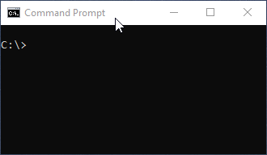

# [TSE Client](https://www.npmjs.com/package/tse-client) [](https://GitHub.com/m-ahmadi/tse-client/tags/) [](https://GitHub.com/m-ahmadi/tse-client/issues/) 
A client for fetching stock data from the Tehran Stock Exchange (TSETMC).  
Works in Browser, Node, and as CLI.  
The `0.x` and `1.x` versions were a direct port of the [official Windows app](http://cdn.tsetmc.com/Site.aspx?ParTree=111A11). 

<p float="left">
	
	
</p>

### [Table of Contents](#table-of-contents)
- [CLI](#cli)
	+ [Install](#install)
	+ [Usage examples](#basic)
- [Node](#node)
	+ [Install](#install-1)
	+ [Usage example](#usage)
- [Browser](#browser)
	+ [Usage example 1](#using-standalone-bundle)
	+ [Usage example 2](#using-the-module-itself)
	+ [Some Info](#some-info)
- [API](#api)
	+ [`API_URL`](#tseapi_url)
	+ [`UPDATE_INTERVAL`](#tseupdate_interval)
	+ [`PRICES_UPDATE_CHUNK`](#tseprices_update_chunk)
	+ [`PRICES_UPDATE_CHUNK_DELAY`](#tseprices_update_chunk_delay)
	+ [`PRICES_UPDATE_RETRY_COUNT`](#tseprices_update_retry_count)
	+ [`PRICES_UPDATE_RETRY_DELAY`](#tseprices_update_retry_delay)
	+ [`CACHE_DIR`](#tsecache_dir)
	+ [`getInstruments()`](#tsegetinstrumentsstruct-boolean-arr-boolean-structkey-string)
	+ [`getPrices()`](#tsegetpricessymbols-string-settings-pricesettings)
	+ [`columnList`](#tsecolumnlist)
	+ [`INTRADAY_URL`](#tseintraday_url)
	+ [`INTRADAY_UPDATE_CHUNK_DELAY`](#tseintraday_update_chunk_delay)
	+ [`INTRADAY_UPDATE_CHUNK_MAX_WAIT`](#tseintraday_update_chunk_max_wait)
	+ [`INTRADAY_UPDATE_RETRY_COUNT`](#tseintraday_update_retry_count)
	+ [`INTRADAY_UPDATE_RETRY_DELAY`](#tseintraday_update_retry_delay)
	+ [`INTRADAY_UPDATE_SERVERS`](#tseintraday_update_servers)
	+ [`getIntraday()`](#tsegetintradaysymbols-string-settings-intradaysettings)
	+ [`getIntradayInstruments()`](#tsegetintradayinstrumentsstruct-boolean-arr-boolean-structkey-string)
	+ [`itdGroupCols`](#tseitdgroupcols)
		- [`price`](#price)
		- [`order`](#order)
		- [`trade`](#trade)
		- [`client`](#client)
		- [`misc`](#misc)
		- [`shareholder`](#shareholder)
- [Note](#note)	
	+ [تغییرنام نمادهای متشابه](#renamed-symbols)
	
# CLI

#### Install:
```shell
npm i tse-client -g
```
#### Basic:
```shell
tse ذوب
tse ذوب فولاد خساپا شپنا
tse "شاخص کل6"
tse "شاخص کل فرابورس6" "شاخص کل (هم وزن)6"
```
#### Adjust prices:
```shell
tse آپ -j 1 # افزایش سرمایه + سود نقدی
tse آپ -j 2 # افزایش سرمایه
```
#### Select columns:
```shell
tse فملی -c "2,3,4,6"
tse فملی -c "2:OPEN 3:HIGH 4:LOW 6:CLOSE"
tse فملی -c "0 6 8 7"
tse فملی -c "0:date 6:closing 8:trades 7:volume"
tse ls -A
tse ls -D
# default: "0 2 3 4 5 6 7 8 9"
```
#### History depth:
```shell
tse ذوب -b 3m       # سه ماه گذشته
tse ذوب -b 40d      # چهل روز گذشته
tse ذوب -b 2y       # دو سال گذشته
tse ذوب -b 13920101 # تاریخ شمسی
tse ذوب -b 20160101 # تاریخ میلادی
tse ذوب -b 13800101 # کمترین تاریخ ممکن (پیش فرض)
tse ذوب -b 20030123 # کمترین تاریخ ممکن به میلادی
```
#### File generation:
```shell
tse کگل -o /mydir # output directory
tse کگل -n 3      # file name
tse کگل -x txt    # file extension
tse کگل -e ascii  # file encoding
tse کگل -l @      # file delimiter char
tse کگل -H        # file without headers
```
#### Select symbols from file:
```shell
tse i -F "i=34" > car.txt
tse i -F "i=27" > iron.txt
tse -i car.txt -o ./car-group
tse -i iron.txt -o ./iron-group
```
#### Select symbols by filter:
```shell
# tse -f "t=نوع نماد  i=کد گروه صنعت  m=بازار  b=کد تابلو  y=کد بازار  g=کد گروه نماد"
# tse -f "P=الگوی نماد  D=الگوی تاریخ میلادی آخرین روز معامله نماد  R حذف نمادهای تغییرنام داده شده"

tse -f "i=27"                 # گروه صنعت: فلزات اساسی
tse -f "i=27 t=300"           # گروه صنعت: فلزات اساسی & نوع نماد: سهم بورس
tse -f "m=4 i=27,53,38 t=404" # بازار: پایه & گروه صنعت: فلزات و سیمان و قند & نوع نماد: حق تقدم
tse -f "t=300 i=43 b=1"       # بازار: بورس & گروه صنعت: دارویی & کد تابلو: تابلوی اصلی

tse ls -T                 # نمایش کد انواع نماد
tse ls -I                 # نمایش کد گروههای صنعت
tse ls -B                 # نمایش کد تابلوها
tse ls -T -I -M -B -Y -G  # نمایش همه

tse i -F "i=27"           # فقط نمایش دادن گروه فلزات

tse i -F "i=27 t=300"     # گروه فلزات بازار بورس
tse i -F "i=27 t=303"     # گروه فلزات بازار فرابورس
tse i -F "i=27 t=309"     # گروه فلزات بازار پایه

tse i -F "i=34 t=300"     # گروه خودرو بازار بورس
tse i -F "i=34 t=303"     # گروه خودرو بازار فرابورس
tse i -F "i=34 t=309"     # گروه خودرو بازار پایه

tse i -F "t=68"           # شاخص های بازار بورس
tse i -F "t=69"           # شاخص های بازار فرابورس

tse i -F "i=43 b=3 t=300" # گروه دارویی تابلوی فرعی بازار بورس
tse i -F "i=43 b=1 t=303" # گروه دارویی تابلوی اصلی بازار فرابورس
tse i -F "i=44 b=5 t=300" # گروه شیمیایی بازار دوم بورس

tse i -F "P=\d$"          # نماد هایی که حرف آخرشان یک عدد (یک رقمی) است
tse i -F "t=309 P=\d$"    # نمادهای بازار پایه که حرف آخرشان یک عدد (یک رقمی) است

tse i -F "D=^2022"        # نمادهایی که روز آخری که معامله شده اند در سال 2022 بوده است
tse i -F "i=72 D=^2022"   # نمادهای گروه رایانه که روز آخری که معامله شده اند در سال 2022 بوده است

tse i -F "i=57 t=303"     # گروه بانکی بازار فرابورس
tse i -F "i=57 t=303 R"   # گروه بانکی بازار فرابورس منهای نمادهای تغییرنام داده شده
```
#### View instrument data:
```shell
tse i                                   # show all symbols
tse i -F "i=33"                         # only those that match the filter
tse i -F "i=33" --cols "Symbol,InsCode" # select different columns
tse i -F "i=33" --cols                  # select all columns
tse ls -N                               # list all possible column names
tse i -F "i=33" --header                # include header row (when printing csv)
tse i -F "i=33" --table                 # print in table format
tse i -F "i=33" --json                  # print as json
tse i -F "i=33" --bom > out.csv         # bom encoding

tse i --cols --header --bom > out.csv             # all  instruments,  all  columns
tse i --cols "Symbol,Name,CIsin" --bom > out.csv  # all  instruments,  some columns
tse i -F "i=51" --cols "LatinSymbol,InstrumentID" # some instruments,  some columns
tse i -F "i=51" --cols --header                   # some instruments,  all  columns
```
#### Similar [renamed symbols](#renamed-symbols) are merged by default:
```shell
tse ذوب       # merged data of ذوب and ذوب-ق2
tse ذوب -u    # only the data of ذوب
tse ذوب-ق2 -u # only the data of ذوب-ق2 
```
#### Get price adjustment data
```shell
tse فولاد -w # get adjust info      (with    price data)
tse فولاد -q # get adjust info only (without price data)
```
#### Disable caching:
```shell
tse ذوب -k
```
#### Save settings:
```shell
tse ذوب فولاد -o ./mytse --save
tse
tse -x txt
tse -n 3 --save
tse -o ./myother --save
tse
```
#### View saved settings and more:
```shell
tse ls -S
tse ls -D
tse ls -T -O 1  # order by count (descending)
tse ls -T -O 1_ # order by count (ascending)
tse ls -h
```

#### Intraday crawler (Experimental):
```shell
tse itd ذوب -o ./mydata             # basic (crawl last day)
tse itd ذوب                         # update but do not generate output
tse itd ذوب -b 6d                   # crawl last 6 days
tse itd ذوب -b 30d -m 20d           # crawl 10 days (from 30 days ago to 20 days ago)
tse itd ذوب -b 13991201 -m 13991206 # crawl 6 days
tse itd ذوب -b 20210219 -m 20210224 # crawl 6 days (Western dates)
tse itd ذوب -k -o .                 # do not cache the data
tse itd ذوب -z -o .                 # output gzip files
tse itd ذوب -y -o .                 # generate results with Shamsi dates
tse itd ذوب -r                      # re-download already cached days that have no `trade` data

tse itd ذوب -o . -e ascii # file encoding
tse itd ذوب -o . -n 2     # directory name
tse itd ذوب -o . -H       # file without headers

tse itd ذوب --retry 0              # only request once without any retrying
tse itd ذوب --retry-delay 5000     # wait 5 seconds between each retry
tse itd ذوب --chunk-delay 2000     # wait 2 seconds before requesting another day
tse itd ذوب --chunk-max-wait 20000 # force end a request if not finished in 20 seconds (only in Node v15+)
tse itd ذوب --servers "4 8"        # only use "cdn4.tsetmc.com" and "cdn8.tsetmc.com" servers
tse itd ذوب --servers "7"          # only use "cdn7.tsetmc.com" server
tse itd ذوب --servers "-1 0"       # only use "tsetmc.com" and "cdn.tsetmc.com" servers
```

# Node

#### Install:
```shell
npm i tse-client
```
#### Usage:
```javascript
const tse = require('tse-client');

(async () => {
  
  // basic
  let res = await tse.getPrices(['ذوب', 'فولاد']);
  if (!res.error) console.log(res.data);
  
  // adjusted data
  res = await tse.getPrices(['خساپا'], {adjustPrices: 1});
  
  // select columns (default names)
  res = await tse.getPrices(['شپنا'], {columns: [0,3,4]});
  
  // select columns (custom names)
  res = await tse.getPrices(['شپنا'], {columns: [[0,'DATE'],[3,'MAX'],[4,'MIN']]});
  
  // view column info
  console.table(tse.columnList);
  
  // list of instruments
  const instruments = await tse.getInstruments();
  console.log(
    instruments.filter(i => i.YVal === '300' && i.CSecVal === '27 ') // گروه فلزات بازار بورس
  );
  
  // intraday crawler
  res = await tse.getIntraday(['ذوب', 'فولاد']), {
    startDate: '20201122',
    endDate: '20201122',
    gzip: false
  });
  
})();
```

# Browser
#### Using standalone bundle:
*(bundled with the 4 dependencies)*
```html
<script src="https://cdn.jsdelivr.net/npm/tse-client/dist/tse.bundle.min.js"></script>
<script>
  tse.getPrices(['فولاد']).then(res => console.log(res.data[0]));
</script>
```

#### Using the module itself:
*(dependencies must be loaded before)*
```html
<script src="https://cdn.jsdelivr.net/npm/big.js"></script>
<script src="https://cdn.jsdelivr.net/npm/localforage"></script>
<script src="https://cdn.jsdelivr.net/npm/jalaali-js/dist/jalaali.min.js"></script>
<script src="https://cdn.jsdelivr.net/npm/pako/dist/pako.min.js"></script>

<script src="https://cdn.jsdelivr.net/npm/tse-client/dist/tse.min.js"></script>
<script>
  tse.getPrices(['فولاد']).then(res => console.log(res.data[0]));
</script>
```

#### Using behind a simple `PHP` proxy:
```php
// proxy.php
<?php
$t  = isset($_GET['t'])  ? $_GET['t']  : '';
$a  = isset($_GET['a'])  ? $_GET['a']  : '';
$a2 = isset($_GET['a2']) ? $_GET['a2'] : '';

echo file_get_contents("http://service.tsetmc.com/tsev2/data/TseClient2.aspx?t=$t&a=$a&a2=$a2");
```
```javascript
tse.API_URL = 'http://path/to/proxy.php';
tse.getPrices(['فولاد']).then(res => console.log(res.data[0]));
```
#### Some Info:
| file | desc
|------------------------|-----------------------|
|`dist/tse.js`           | Unminified code. |
|`dist/tse.min.js`       | Minified code. |
|`dist/tse.bundle.min.js`| Minified dependencies + minified code. |

dependency | desc
-------|-------------
`big.js`      | `Required`. For price adjustment calculations.
`localforage` | `Required`. For storing in `indexedDB`. 
`jalaali-js`  | `Optional`. Only needed for `dateshamsi` column. *(Recommanded to not exclude this, though you can)*
`pako`        | `Semi-Required`. Only used by [`getIntraday()`](#tsegetintradaysymbols-string-settings-intradaysettings).


# API

#### `tse.API_URL`
The API URL to use for HTTP requests.  
Only string and valid URL.  
Default: `http://service.tsetmc.com/tsev2/data/TseClient2.aspx`
#### `tse.UPDATE_INTERVAL`
Update data only if these many days have passed since the last update.  
Only positive integers or zero.  
Default: `1`
#### `tse.PRICES_UPDATE_CHUNK`
Amount of instruments per request.  
Only positive integers.  
Min: `1`  
Max: `59`  
Default: `50`
#### `tse.PRICES_UPDATE_CHUNK_DELAY`
Amount of delay (in ms) to wait before requesting another chunk of instruments.  
Only positive integers or zero.  
Default: `300`
#### `tse.PRICES_UPDATE_RETRY_COUNT`
Amount of retry attempts before giving up.  
Only positive integers or zero.  
Default: `3`
#### `tse.PRICES_UPDATE_RETRY_DELAY`
Amount of delay (in ms) to wait before making another retry.  
Only positive integers or zero.  
Default: `1000`
#### `tse.CACHE_DIR`
Only in `Node`.  
Location of the cache directory.  
If the location is changed, existing content is not moved to the new location.  
Default: &ensp; *`User's home directoy:`* &ensp; `require('os').homedir()`  
#### `tse.getInstruments(struct?: boolean, arr?: boolean, structKey?: string)`
Update (if needed) and return list of instruments.  
- **`struct`:** Determine the return type for each instrument. Default `true`
	+ `true`: return an `Instrument` object for each instrument.
	+ `false`: return a CSV string for each instrument.
- **`arr`:** Determine the return type. Default: `true`
	+ `true`: return an array.
	+ `false` return an `Instruments` object.
- **`structKey`:** Which key of `Instrument` to use when `struct` is set to `true`. Default: `'InsCode'`

**return:** `Array<Instrument | string> | Instruments`  

Visit the [official documentation](http://cdn.tsetmc.com/Site.aspx?ParTree=1114111118&LnkIdn=83) for description of each `Instrument` field.  
```typescript
interface Instrument {
//                            👇 C# equivalent
  InsCode:         string;  // long (int64)
  InstrumentID:    string;  // string
  LatinSymbol:     string;  // string
  LatinName:       string;  // string
  CompanyCode:     string;  // string
  Symbol:          string;  // string
  Name:            string;  // string
  CIsin:           string;  // string
  DEven:           string;  // int (int32)
  Flow:            string;  // byte
  LSoc30:          string;  // string
  CGdSVal:         string;  // string
  CGrValCot:       string;  // string
  YMarNSC:         string;  // string
  CComVal:         string;  // string
  CSecVal:         string;  // string
  CSoSecVal:       string;  // string
  YVal:            string;  // string
  SymbolOriginal?: string;
}

interface Instruments {
  [Instrument.InsCode]: Instrument | string;
}
```
#### `tse.getPrices(symbols: string[], settings?: PriceSettings)`
Update (if needed) and return prices of instruments.  
- **`symbols`:** An array of *`Farsi`* instrument symbols.  
- **`settings`:** A settings object.
	+ **`columns`:** Select which `ClosingPrice` props (except `adjustInfo`) to return and specify optional string for the prop.  
		For example: `[ [0,'DATE'], [6,'CLOSE'], [7,'VOL'] ]`  
		Default: `[0,2,3,4,5,6,7,8,9]`  
		See [`columnList`](#tsecolumnlist) for the list of all column indexes and their names.
	+ **`adjustPrices`:** The type of adjustment applied to returned prices.  
		`0`: None &emsp; &emsp;&emsp;&emsp;&emsp;&emsp;&emsp;&emsp;&emsp;&emsp;&emsp;(*`بدون تعدیل`*)  
		`1`: Capital Increase + Dividends &emsp; (*`افزایش سرمایه + سود نقدی`*)  
		`2`: Capital Increase &emsp;&emsp;&emsp;&emsp;&emsp;&emsp;&emsp;(*`افزایش سرمایه`*)
	+ **`getAdjustInfo`:** If `true`, an additional property named `adjustInfo` will be appended to the `ClosingPrice` object, which contains all the information needed to manually adjust prices. Default: `false`
	+ **`getAdjustInfoOnly`:** Get `adjustInfo` data but without the rest of `ClosingPrice` data. Default: `false`
	+ **`startDate`:** Only return prices after this date. Min: `'20010321'`. Default: `'20010321'`
	+ **`daysWithoutTrade`:** Whether to include days that have `0` trades. Default: `false`
	+ **`mergeSimilarSymbols`:** Whether to merge the data of similar [renamed symbols](#renamed-symbols). Default: `true`
	+ **`cache`:** Whether to cache the downloaded data. Default: `true`
	+ **`csv`:** Generate results as CSV strings. Default: `false`
	+ **`csvHeaders`:** Include header row when generating CSV results. Default: `true`
	+ **`csvDelimiter`:** A cell delimiter character to use when generating CSV results. Default: `','`
	+ **`onprogress`:** A callback function which gets called with a number indicating the progress. Default: `undefined`
	+ **`progressTotal`:** A number to use as the completion point of progress. Default: `100`
	+ **`debugMergeSimilarSymbols`:** Get some stats on merged symbols. Default: `false`

**return:** `Result`
```typescript
interface Result {
  data:   Array<ClosingPrice>;
  error?: CustomError;
	debug?: DebugResult;
}

interface ClosingPrice {
//                          👇 C# equivalent of array item
  date:        number[];  // int     (int32)
  dateshamsi:  number[];  // int     (int32)
  open:        number[];  // decimal (float128)
  high:        number[];  // decimal (float128)
  low:         number[];  // decimal (float128)
  last:        number[];  // decimal (float128)
  close:       number[];  // decimal (float128)
  vol:         number[];  // decimal (float128)
  count:       number[];  // decimal (float128)
  value:       number[];  // decimal (float128)
  yesterday:   number[];  // decimal (float128)
  symbol:      string[];  // string
  name:        string[];  // string
  namelatin:   string[];  // string
  companycode: string[];  // string
  adjustInfo?: {events: AdjustEvent[], validGPLRatio: boolean};
}

interface AdjustEvent {
  date:             string;
  type:             'capital increase' | 'dividend';
  priceBeforeEvent: string;
  priceAfterEvent:  string;
  dividend?:        string; // only when `type` is 'dividend'
  increasePct?:     string; // only when `type` is 'capital increase'
  oldShares?:       string; // only when `type: is 'capital increase'
  newShares?:       string; // only when `type` is 'capital increase'
}

interface PriceSettings {               
  columns?:                     Array<[number, string?]>;
  adjustPrices?:                AdjustOption;
  getAdjustInfo?:               boolean;
  getAdjustInfoOnly?:           boolean;
  daysWithoutTrade?:            boolean;
  startDate?:                   string;
  mergeSimilarSymbols?:         boolean;
  csv?:                         boolean;
  csvHeaders?:                  boolean;
  csvDelimiter?:                string;
  cache?:                       boolean;
  onprogress?(current: number): void;
  progressTotal?:               number;
}

interface CustomError {
  code:     ErrorType;
  title:    string;
  detail?:  string | Error;
  symbols?: string[];
  fails?:   string[];
  succs?:   string[];
}

interface DebugResult {
  mergeSets?: DebugMergeSet[];
}
interface DebugMergeSet {
  mergeItems: MergeItem[];
  hasOverlap: boolean;
  statsAtEachOverlap: MergeOverlapStats[];
}
interface MergeItem {
  sym: string;
  code: string;
  order: number;
  dayFirst: number;
  dayLast: number;
}
interface MergeOverlapStats {
  trimForw: MergeOverlapDirectionalStats;
  trimBack: MergeOverlapDirectionalStats;
}
interface MergeOverlapDirectionalStats {
  count: number;
  adjs: number;
  trades: number;
  fixable: boolean;
}

enum AdjustOption {
  None = 0,
  CapitalIncreasePlusDividends = 1,
  CapitalIncrease = 2
}

enum ErrorType {
  FailedRequest = 1,
  IncorrectSymbol = 2,
  IncompletePriceUpdate = 3
}
```
**Example:**
```javascript
const defaultSettings = {
  columns:             [0,2,3,4,5,6,7,8,9],
  adjustPrices:        0,
  getAdjustInfo:       false,
  getAdjustInfoOnly:   false,
  daysWithoutTrade:    false,
  startDate:           '20010321',
  mergeSimilarSymbols: true,
  csv:                 false,
  csvHeaders:          true,
  csvDelimiter:        ',',
  cache:               true,
  onprogress:          undefined,
  progressTotal:       100
};

const result = await tse.getPrices(symbols=['sym1', 'sym2', ...], defaultSettings);

result.data /*
  [
    // sym1
    {
      open:  [0, 0, ...],
      high:  [0, 0, ...],
      low:   [0, 0, ...],
      last:  [0, 0, ...],
      close: [0, 0, ...],
      vol:   [0, 0, ...],
      count: [0, 0, ...],
      value: [0, 0, ...]
    },

    // sym2
    {
      open: [],
      high: [],
      ...
    },

    ...
  ]
*/

result.error // possible values:

undefined

{ code: 1, title: 'Failed request...',       detail: '' | Error }

{ code: 2, title: 'Incorrect Symbol',        symbols: [] }

{ code: 3, title: 'Incomplete Price Update', fails: [], succs: [] }

```

#### `tse.columnList`
A list of all possible columns.

index | name        | fname
------|-------------|------------------
0     | date        | تاریخ میلادی
1     | dateshamsi  | تاریخ شمسی
2     | open        | اولین قیمت
3     | high        | بیشترین قیمت
4     | low         | کمترین قیمت
5     | last        | آخرین قیمت
6     | close       | قیمت پایانی
7     | vol         | حجم معاملات
8     | count       | تعداد معاملات
9     | value       | ارزش معاملات
10    | yesterday   | قیمت پایانی دیروز
11    | symbol      | نماد
12    | name        | نام
13    | namelatin   | نام لاتین
14    | companycode | کد شرکت


#### `tse.INTRADAY_URL`
The URL from which the data is crawled.  
Must be a function that returns a valid URL string.  
Default:
```javascript
(server='', inscode='', deven='') => `http://${server > 0 ? 'cdn'+server+'.' : server < 0 ? '' : 'cdn.'}tsetmc.com/Loader.aspx?ParTree=15131P&i=${inscode}&d=${deven}`;
```
#### `tse.INTRADAY_UPDATE_CHUNK_DELAY`
Amount of delay (in ms) to wait before requesting another chunk of dates.  
Only positive integers or zero.  
Default: `100`
#### `tse.INTRADAY_UPDATE_CHUNK_MAX_WAIT`
Max time (in ms) to wait for a request to finish before force ending it.  
In Node, it needs Node v15+ or it has no effect.  
Only positive integers or zero.  
Default: `60000`
#### `tse.INTRADAY_UPDATE_RETRY_COUNT`
Amount of retry attempts before giving up.  
Only positive integers or zero.  
Default: `3`
#### `tse.INTRADAY_UPDATE_RETRY_DELAY`
Amount of delay (in ms) to wait before making another retry.  
Only positive integers or zero.  
Default: `1000`
#### `tse.INTRADAY_UPDATE_SERVERS`
Array of integers to use as CDN servers in the update process.  
Note that any negative number will result to `tsetmc.com` server.  
Note that `0` will result to `cdn.tsetmc.com` server.  
Only an array of only positive integers or zero.  
Default: `[-1,0]`
#### `tse.getIntradayInstruments(struct?: boolean, arr?: boolean, structKey?: string)`
Returns the list of instruments crawled by [`getIntraday()`](#tsegetintradaysymbols-string-settings-intradaysettings).  
The information of each instrument is from the latest crawled day.  
- **`struct`:** Determine the return type for each instrument. Default `true`
	+ `true`: return an `InstrumentITD` object for each instrument.
	+ `false`: return a CSV string for each instrument.
- **`arr`:** Determine the return type. Default: `true`
	+ `true`: return an array.
	+ `false` return an `InstrumentsITD` object.
- **`structKey`:** Which key of `InstrumentITD` to use when `struct` is set to `true`. Default: `'InsCode'`

**return:** `Array<InstrumentITD | string> | InstrumentsITD`  

```typescript
interface InstrumentITD {
  InsCode:        string;
  LVal30:         string;
  LVal18AFC:      string;
  FlowTitle:      string;
  CGrValCotTitle: string;
  Flow:           string;
  CGrValCot:      string;
  CIsin:          string;
  InstrumentID:   string;
  ZTitad:         string;
  BaseVol:        string;
}

interface InstrumentsITD {
  [InstrumentITD.InsCode]: InstrumentITD | string;
}
```
#### `tse.getIntraday(symbols: string[], settings?: IntradaySettings)`
Crawl intraday data from the instrument's history page of the [tsetmc.com](http://tsetmc.com) website. **(Experimental)**
- **`symbols`:** An array of *`Farsi`* instrument symbols.  
- **`settings`:** A settings object.
	+ **`startDate`:** Only return data after this date. Min: `'20010321'`. Default: `'20010321'`
	+ **`endDate`:** Only return data before this date. Default: `''`
	+ **`cache`:** Whether to cache the downloaded data. Default: `true`
	+ **`gzip`:** Return data as Gzip `Buffer` in Node or `Uint8Array` in Browser. Default: `true`
	+ **`reUpdateNoTrades`:** Re-download any cached item that has no [`trade`](#trade) data. Default: `false`
	+ **`updateOnly`:** Perform update but don't return any data. Default: `false`
	+ **`onprogress`:** A callback function which gets called with a number indicating the progress. Default: `undefined`
	+ **`progressTotal`:** A number to use as the completion point of progress. Default: `100`
	+ **`chunkDelay`:** Per call option of [`INTRADAY_UPDATE_CHUNK_DELAY`](#tseintraday_update_chunk_delay). Default: `value of constant`
	+ **`chunkMaxWait`:** Per call option of [`INTRADAY_UPDATE_CHUNK_MAX_WAIT`](#tseintraday_update_chunk_max_wait). Default: `value of constant`
	+ **`retryCount`:** Per call option of [`INTRADAY_UPDATE_RETRY_COUNT`](#tseintraday_update_retry_count). Default: `value of constant`
	+ **`retryDelay`:** Per call option of [`INTRADAY_UPDATE_RETRY_DELAY`](#tseintraday_update_retry_delay). Default: `value of constant`
	+ **`servers`:** Per call option of [`INTRADAY_UPDATE_SERVERS`](#tseintraday_update_servers). Default: `value of constant`

**return:** `Result`
```typescript
interface Result {
  data:   Array< [number[], Array<Buffer | Uint8Array | string>] >;
  error?: CustomError;
}

interface IntradaySettings {               
  startDate?:                   string;
  endDate?:                     string;
  cache?:                       boolean;
  gzip?:                        boolean;
  onprogress?(current: number): void;
  progressTotal?:               number;
  chunkDelay?:                  number;
  chunkMaxWait?:                number;
  retryCount?:                  number;
  retryDelay?:                  number;
  servers?:                     number[];
}

interface CustomError {
  code:     ErrorType;
  title:    string;
  detail?:  string | Error;
  symbols?: string[];
  fails?:   string[];
  succs?:   string[];
}

enum ErrorType {
  FailedRequest = 1,
  IncorrectSymbol = 2,
  IncompletePriceUpdate = 3,
  IncompleteIntradayUpdate = 4
}
```

#### `tse.itdGroupCols`
A list of all intraday data groups and their column names.

## `price`
time | last      | close    | open | high | low   | count     | volume    | value       | discarded
---- |-----------|----------|------|------|-------|-----------|-----------|-------------|-----------
زمان  | آخرین معامله | قیمت پایانی | اولین  | بیشترین | کمترین | تعداد معاملات | حجم معاملات |  ارزش معاملات | باطل شده


## `order`
time | row  | askcount | askvol   | askprice | bidprice  | bidvol  | bidcount
-----|------|----------|----------|----------|-----------|---------|---------
زمان  | ردیف | تعداد تقاضا  | حجم تقاضا  | قیمت تقاضا | قیمت عرضه | حجم عرضه | تعداد عرضه


## `trade`
time | count | volume | price | discarded
-----|-------|--------|-------|---------
زمان  | تعداد   | حجم    | قیمت   | باطل شده 

## [`client`](http://cdn.tsetmc.com/Site.aspx?ParTree=1114111116&LnkIdn=3568)


column | desc | desc Fa
-----------|----------------------------------------|----------------------------
`pbvol`    | Person Buy Volume                      | حجم خرید حقیقی
`pbcount`  | Person Buy Count                       | تعداد خرید حقیقی
`pbval`    | Person Buy Value                       | ارزش خرید حقیقی
`pbprice`  | Person Buy Price                       | قیمت خرید حقیقی
`pbvolpot` | Person Buy Volume Percentage of Total  | درصد حجم خرید حقیقی از کل حجم
.          |                                        |
`psvol`    | Person Sell Volume                     | حجم فروش حقیقی
`pscount`  | Person Sell Count                      | تعداد فروش حقیقی
`psval`    | Person Sell Value                      | ارزش فروش حقیقی
`psprice`  | Person Sell Price                      | قیمت فروش حقیقی
`psvolpot` | Person Sell Volume Percentage of Total | درصد حجم فروش حقیقی از کل حجم
.          |                                        | 
`lbvol`    | Legal Buy Volume                       | حجم خرید حقوقی
`lbcount`  | Legal Buy Count                        | تعداد خرید حقوقی
`lbval`    | Legal Buy Value                        | ارزش خرید حقوقی
`lbprice`  | Legal Buy Price                        | قیمت خرید حقوقی
`lbvolpot` | Legal Buy Volume Percentage of Total   | درصد حجم خرید حقوقی از کل حجم
.          |                                        | 
`lsvol`    | Legal Sell Volume                      | حجم فروش حقوقی
`lscount`  | Legal Sell Count                       | تعداد فروش حقوقی
`lsval`    | Legal Sell Value                       | ارزش فروش حقوقی
`lsprice`  | Legal Sell Price                       | قیمت فروش حقوقی
`lsvolpot` | Legal Sell Volume Percentage of Total  | درصد حجم فروش حقوقی از کل حجم
.          |                                        | 
`lpchg` | Legal to Person Ownership Transfer        | تغییر مالکیت حقوقی به حقیقی

## `misc`
basevol | flow | daymin      | daymax       | state
--------|------|-------------|--------------|--------
حجم مبنا  | بازار  | کمینه قیمت مجاز | بیشینه قیمت مجاز | [وضعیت نماد](http://cdn.tsetmc.com/Site.aspx?ParTree=111411111Y&LnkIdn=833) 

## `shareholder`
shares | sharespot     | change | companycode | companyname
-------|---------------|--------|-------------|-------------
تعداد سهم | درصد از کل سهام | نوع تغییر | کد شرکت     | نام شرکت

# Note
- `Instrument.Symbol` characters are cleaned from `zero-width` characters, `ك` and  `ي`.  
- The price adjustment algorithm is still a direct port of the [official Windows app](http://cdn.tsetmc.com/Site.aspx?ParTree=111A11).
- In Browser, the `InstrumentAndShare` data is stored in `localStorage`.
- In Browser, the `ClosingPrices` data is stored in `indexedDB`.
- In Node, data compression is done with the `zlib` module.

<div dir="rtl">

- ### Renamed Symbols
  برای منحصر به فرد بودن تمامی نمادها، نمادهای متشابه بر اساس الگوریتم زیر تغییرنام داده می شوند:
  ```
  در صورت مواجه با نمادهای متشابه
      نمادهای متشابه بر اساس آخرین روزی که فعال بوده اند مرتب شده، سپس
      نمادی که دارای جدیدترین تاریخ است، دست نخورده باقی مانده، و
      به باقی نمادها یک خط تیره "-" و حرف "ق" و عدد جایگاه نماد در لیست مرتب شده اضافه می شود
  ```
  نماد های تغییرنام داده شده را نمایش می دهد `tse ls -R` فرمان.

</div>
